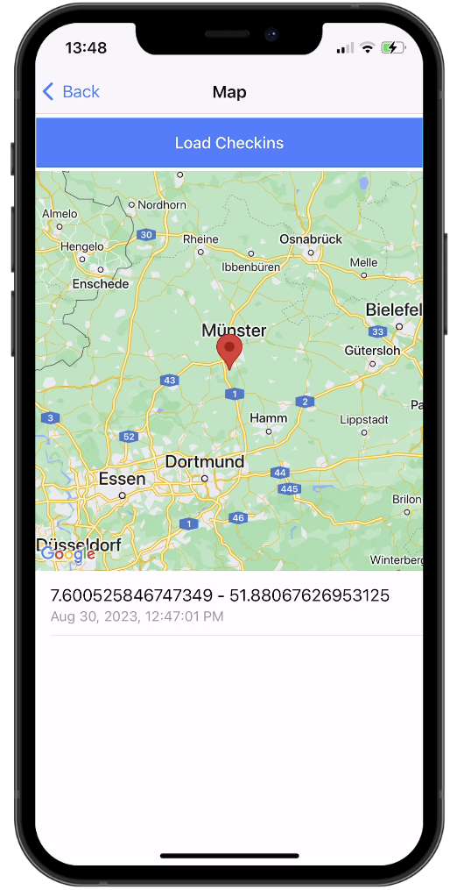
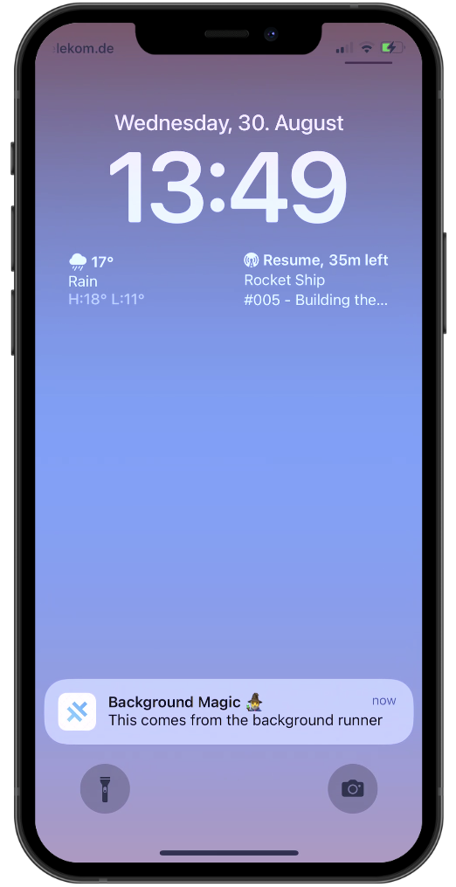

## Capacitor Background Task Example App

This project is an example of the new [Capacitor Background Runner](https://capacitorjs.com/docs/apis/background-runner). It includes usage of the Capacitor key-value storage, Notifications and Geolocation.

## Disclaimer

This repository was created with a very early version of the Capacitor Background Runner so changes are to be expected. This is not a production-ready example.

### Testing this example

Follow the instructions for the Background Runner to update your iOS and Android platforms & permissions.

For Google Maps, please include your API key inside the `src/app/map/map.page.ts` file and the `android/app/src/main/AndroidManifest.xml` file.

## Preview

